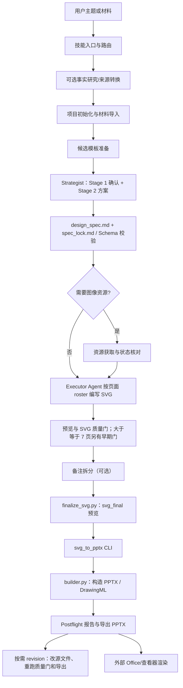
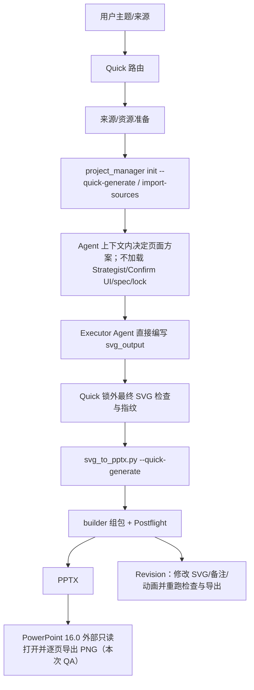

# PPT Master 从输入到 PPTX 的调用链

- Requirement ID：`RES-P01-02`
- Task ID：`TASK-RES-P01-02`；验证：`VERIFY-RES-P01-02`
- 上游固定版本：`hugohe3/ppt-master`，`main`，commit `2d72da616cf9fa40d4dcaf59fd4c980ecf534b7d`
- 范围：依据固定 commit 的工作流、Prompt、Schema 与代码建立可定位的调用图；Quick 有实际运行轨迹，Default 仅做源码追踪。

## 执行边界

PPT Master 是供 Agent Host 加载的技能/工作流包，不是自带模型循环的独立应用。路由规则、Prompt、CLI、Schema、检查器和 PPTX 组包器在上游仓库中；LLM 推理、Agent Host 的工具调度，以及默认路线中由用户完成的确认没有可复现的本地模型/调度实现，均标为外部黑盒。本文把“源码说明的流程”和“实际运行日志观察到的流程”分开，未运行的 Default 路线不标成实测。

## Default 路线（源码追踪）

1. **入口与路由**：技能加载顺序和路由矩阵按请求选 Default 或 Quick。普通生成进入 `generate-pptx.md`；Quick 明确意图进入 `quick-generate.md`；图片还原始终走 Quick，Beautify 依请求选路由。
2. **输入与项目**：Default Step 1 读取 Markdown 或通过 `source_to_md.py` 转换 Office、PDF、网页等输入；事实缺口才进入可选 topic research。Step 2 由 `project_manager.py init` 创建项目，`import-sources` 归档来源并形成材料。
3. **候选模板与规划**：Default Step 3 准备模板候选；Strategist Prompt 负责 Stage 1 沟通契约/模板选择和 Stage 2 页面方案。确认面向用户或显式委托；Agent 不得伪造用户回执。方案落到 `design_spec.md` 和执行子集 `spec_lock.md`，项目管理器按对应 Schema 校验。
4. **资源与页面**：Step 5 按已确认方案条件性获取图片/资源。Executor Prompt 接收页面 roster、内容和锁定约束，由 Agent Host 内的 Agent 逐页写入 `svg_output/`。PPT Master 仓库没有定义通用模型调用循环，因此实际 SVG 生成属于外部模型执行；提示、输入规则和工具位置可在索引中定位。
5. **质量、预览和导出**：Step 6 运行 SVG 质量门；7 页及以上另在 P05 后运行早期门。备注拆分为可选步骤；`finalize_svg.py` 生成独立 `svg_final/` 预览。`svg_to_pptx.py` 调用包内 CLI 与 builder，把 SVG/资产组装成 PPTX，并写 postflight 状态/报告。
6. **渲染与修订**：上游这条主链没有内置 PowerPoint/LibreOffice 渲染步骤。幻灯片在 PowerPoint/其他查看器中的最终渲染属于外部组件；项目可另行执行视觉审查。Revision Round 修改现有项目源文件并重跑对应质量门和导出，不是从 PPTX 反向修改的通用能力。

## Quick 路线（运行日志观察 + 源码补全）

Quick 不是 Default 的快速参数组合，而是单独的完整生成配置：它省略 Strategist、确认界面、`design_spec` 和 `spec_lock`，由 Agent 在当前上下文内决定；Exporter 从 SVG 推断结构模式，不调用 `finalize_svg.py`。运行日志实际观测到 Quick 项目初始化、来源导入、文字测量校准、最终 SVG 检查、PPTX 导出与 postflight。PPTX 后续由本机 Microsoft PowerPoint 16.0 只读打开并导出 3 张 1920×1080 PNG；这是外部 QA，不是容器生成步骤或产品运行时选型。

## 与该调用图对应的证据

- 实际 Quick trace：`projects/p01_hello_world_20261007/validation/workflow.log`。
- PPTX/页面与 PowerPoint 原生渲染校验：`projects/p01_hello_world_20261007/validation/verify-res-p01-01.json`、`validation/native-render/slide-01.png` 至 `slide-03.png`、`exports/p01-hello-world.pptx`。
- 正常运行结果：3 页、17 个文本对象；PPTX SHA-256 `c39b6b596b6c6df0c69d8bdc2886eac5d1339cab5f148833951f1370095acd25`；ZIP/读取/质量门/Postflight/PowerPoint 打开与渲染均通过。
- 边界/失败结果：只读安装目录作为默认写入目标时初始化返回 `OSError errno=30`（只读文件系统）；将项目目录显式设为可写挂载后成功。初次边界记录见项目日志 `ailog/复现PPTMaster最小生成流程_20261007-182450.md` 和对应 `development-log/` 文件；简化结果也保存在 `research/P01/README.md`。
- 实际运行范围只有 Quick；Default 节点由固定源码行定位，尚无 Default 全链路运行证据。

## 主链节点与定位

节点、源码文件、函数/Prompt/Schema 和提交固定链接详见同目录 `source_index.json`。关键节点包括：技能路由；来源转换；项目 CLI；Strategist 与 `design_spec`/`spec_lock`；模板/画布规则；Executor SVG 页面源；SVG 检查器；Default 预览终结；PPTX CLI/Builder/Postflight；Revision Round；外部 Agent Host 与 Office 渲染边界。

## 本任务未覆盖

此调用图用于完成 `RES-P01-02`；未拆解每个页面决策输入/候选/fallback（`RES-P01-03`）、未量化模板/版式/中间表示（`RES-P01-04`），也未形成 PPT 能力矩阵（`RES-P01-05`）。这些任务继续按矩阵依赖逐项执行。
