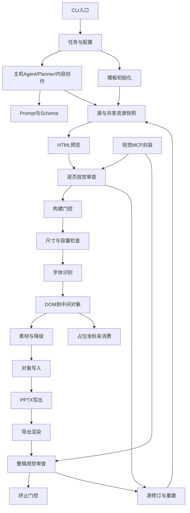

# P02 调用链与源码索引

固定 main `833cda553b343be0e486a93b0b57cac962cdd566` + 实际 requirements 依赖 `pptagent==1.1.37`。v0.2.0/v1.1.38 是独立历史版本，未静默混用。所有文件 hash/函数范围见 [SourceIndex](source-index.json)。这是上游研究交付，产品架构/运行时未选定，AC-001–030 未执行。

## entry · CLI入口

- 执行主体：main
- 输入：command/config/workspace
- 机制：argparse命令分派；exception→2，ok=false→1
- 输出：JSON结果与exit0/1/2
- 源码：`cli:main` (main Skill `scripts/pptagent.py:236`); `cli:make_parser` (main Skill `scripts/pptagent.py:197`)
- 证据：validation/verify-official-six.json, validation/workflow-probes.json
- 边界：仅此节点职责，不扩充为产品全能力

## task · 任务与配置

- 执行主体：main
- 输入：slides/aspect/language/config
- 机制：正整数页数；3种比例；strict/best-effort与text/multimodal
- 输出：task.json + normalized config
- 源码：`cli:init_workspace` (main Skill `scripts/pptagent.py:107`); `core:load_task` (main Skill `scripts/pptagent_runtime/core.py:40`); `config:load_config` (main Skill `scripts/pptagent_runtime/config.py:27`)
- 证据：validation/verify-official-six.json, validation/workflow-probes.json
- 边界：仅小型任务配置，不是完整TaskSpec；不推断页数/用户用途

## host · 主机Agent/Planner/内容创作

- 执行主体：external host
- 输入：用户材料/任务约束/本地素材
- 机制：Skill要求主机规划并创作；上游CLI没有内容生成或Planner函数
- 输出：每页HTML
- 源码：`skill:resource` (main Skill `SKILL.md:1`); `contract:resource` (main Skill `references/task-contract.md:1`)
- 证据：validation/verify-official-six.json, validation/author-prompts.json, validation/author-response.json
- 边界：内部候选、推理、评分不可观察；author-six.py是研究模型调用，不属于上游Planner

## prompt · Prompt与Schema

- 执行主体：main + host
- 输入：task/HTML/images
- 机制：资源描述约束；函数直接字段校验
- 输出：task contract、visual JSON、state v1
- 源码：`visual:module` (main Skill `scripts/pptagent_runtime/visual.py:1`); `core:load_task` (main Skill `scripts/pptagent_runtime/core.py:40`); `skill:resource` (main Skill `SKILL.md:1`); `text-contract:resource` (main Skill `references/text.md:1`)
- 证据：validation/verify-official-six.json, validation/visual-slides-traced-01.json
- 边界：没有完整规划/模板/页面JSON Schema或结构化策略trace；不保留隐藏推理

## scaffold · 模板初始化

- 执行主体：main
- 输入：task + 4 distinct replacement tokens
- 机制：单一通用模板、保持既有页面
- 输出：assets/slide-template.html与slideNN.html
- 源码：`core:scaffold` (main Skill `scripts/pptagent_runtime/core.py:110`); `starter:resource` (main Skill `assets/slide-template.html:1`)
- 证据：validation/verify-official-six.json
- 边界：没有模板族选择/引用PPTX解析

## snapshot · 源与共享资源快照

- 执行主体：main
- 输入：task/slides/assets字节
- 机制：所有assets与slides非HTML资源一起hash
- 输出：hash快照与原子状态文件
- 源码：`core:input_snapshot` (main Skill `scripts/pptagent_runtime/core.py:93`); `core:load_state` (main Skill `scripts/pptagent_runtime/core.py:70`); `core:save_state` (main Skill `scripts/pptagent_runtime/core.py:83`)
- 证据：validation/verify-official-six.json, validation/maps-probes.json
- 边界：资源依赖按整体；未使用资源也会使审查过期

## render · HTML预览

- 执行主体：main + dependency
- 输入：HTML、允许的本地资源、固定canvas
- 机制：Chromium；阻断未跟踪与非file请求；等字体
- 输出：逐页JPG和渲染hash
- 源码：`core:render_slides` (main Skill `scripts/pptagent_runtime/core.py:176`); `core:open_slide` (main Skill `scripts/pptagent_runtime/core.py:148`); `webview:module` (installed pptagent1.1.37 `utils/webview.py:1`)
- 证据：validation/verify-official-six.json, validation/maps-probes.json
- 边界：不是全面JS沙箱；converter自身goto没有同一路由防护

## slide-review · 逐页视觉审查

- 执行主体：main + host/provider
- 输入：新鲜HTML JPG + context
- 机制：主机图像审查或OpenAI-compatible POST；严格JSON校验
- 输出：review record
- 源码：`cli:review_slides` (main Skill `scripts/pptagent.py:126`); `visual:review_images` (main Skill `scripts/pptagent_runtime/visual.py:51`); `visual:validate_review` (main Skill `scripts/pptagent_runtime/visual.py:15`); `core:record_slide_review` (main Skill `scripts/pptagent_runtime/core.py:211`)
- 证据：validation/verify-official-six.json, validation/visual-slides-traced-01.json, validation/maps-probes.json
- 边界：真实external返回字符串slide失败；官方默认host路线已通过；没有事实QA

## build-gate · 构建门控

- 执行主体：main
- 输入：HTML数量与fresh pass review
- 机制：strict门控、固定output answer.pptx、当前driver PATH
- 输出：Node converter invocation
- 源码：`core:build` (main Skill `scripts/pptagent_runtime/core.py:283`); `core:review_gaps` (main Skill `scripts/pptagent_runtime/core.py:243`); `config:node_environment` (main Skill `scripts/pptagent_runtime/config.py:54`)
- 证据：validation/verify-official-six.json, validation/workflow-probes.json, validation/maps-probes.json
- 边界：仅此节点职责，不扩充为产品全能力

## dimension · 尺寸与容量检查

- 执行主体：dependency
- 输入：computed body/scroll/文字bounds
- 机制：1px overflow、0.1in layout、font>12pt时bottom>=0.5in
- 输出：匹配layout或错误
- 源码：`converter:getBodyDimensions` (installed pptagent1.1.37 `html2pptx/html2pptx.js:50`); `converter:adaptLayout` (installed pptagent1.1.37 `html2pptx/html2pptx.js:87`); `converter:validateTextBoxPosition` (installed pptagent1.1.37 `html2pptx/html2pptx.js:120`)
- 证据：validation/verify-official-six.json, validation/footer-revision.json
- 边界：是候选写入器的规则，不是产品容量策略或普遍PowerPoint限制

## font · 字体识别

- 执行主体：dependency
- 输入：DOM/CSS/CDP actual-font
- 机制：CDP glyph count dominant font；否则CSS首个非generic或MicrosoftYaHei
- 输出：fontFace
- 源码：`converter:html2pptx` (installed pptagent1.1.37 `html2pptx/html2pptx.js:2835`); `converter:font-family` (installed pptagent1.1.37 `html2pptx/html2pptx.js:726`)
- 证据：validation/verify-official-six.json
- 边界：逐段mixed字体精度/PowerPoint替换未验证；CDP错误会静默忽略

## ir · DOM到中间对象

- 执行主体：dependency
- 输入：computed CSS + DOM tree
- 机制：DOM位置px→inch、字体px→pt、processed dedupe
- 输出：background/elements/placeholders/errors
- 源码：`converter:extractSlideData` (installed pptagent1.1.37 `html2pptx/html2pptx.js:708`)
- 证据：validation/maps-probes.json
- 边界：私有reader只在研究进程内暴露；pre-CDP IR；无page-type/slot语义schema

## assets · 素材与降级

- 执行主体：dependency
- 输入：CSS gradient/bg/image/SVG
- 机制：浏览器栅格化复杂样式；strict检查missing asset
- 输出：PNG或错误
- 源码：`converter:rasterizeGradients` (installed pptagent1.1.37 `html2pptx/html2pptx.js:171`); `converter:html2pptx` (installed pptagent1.1.37 `html2pptx/html2pptx.js:2835`)
- 证据：validation/maps-probes.json
- 边界：渐变实测PNG；inline SVG在前置className检查失败；无统一fallback trace

## native · 对象写入

- 执行主体：dependency
- 输入：IR
- 机制：顺序调用addText/addShape/addTable/addImage
- 输出：PptxGenJS原生text/shape/line/table/image
- 源码：`converter:addBackground` (installed pptagent1.1.37 `html2pptx/html2pptx.js:155`); `converter:addElements` (installed pptagent1.1.37 `html2pptx/html2pptx.js:544`)
- 证据：validation/verify-official-six.json, validation/maps-probes.json
- 边界：对象子集，不含原生chart；slot coordinates不等于placeholder对象

## placeholder · 占位坐标未消费

- 执行主体：dependency
- 输入：class placeholder + nonzero bounds
- 机制：库返回coords；官方CLI仅转换每页，忽略返回placeholder
- 输出：id/x/y/w/h
- 源码：`converter:placeholder-extract` (installed pptagent1.1.37 `html2pptx/html2pptx.js:1546`); `converter-cli:module` (installed pptagent1.1.37 `html2pptx/html2pptx_cli.js:1`)
- 证据：validation/maps-probes.json
- 边界：没有chart生成，也没有原生placeholder绑定

## export · PPTX写出

- 执行主体：dependency + main
- 输入：converted slides
- 机制：writeFile + ZIP结构/页数/比例检查
- 输出：answer.pptx + count/aspect/hash
- 源码：`converter-cli:module` (installed pptagent1.1.37 `html2pptx/html2pptx_cli.js:1`); `core:build` (main Skill `scripts/pptagent_runtime/core.py:283`); `core:pptx_info` (main Skill `scripts/pptagent_runtime/core.py:258`)
- 证据：validation/verify-official-six.json, validation/maps-probes.json
- 边界：新建文件；没有普通PPTX读取或原位保真编辑入口

## deck-render · 导出渲染

- 执行主体：main
- 输入：answer.pptx
- 机制：LibreOffice隔离profile→PyMuPDF→每4页contact
- 输出：PDF/逐页JPG/contact
- 源码：`core:render_deck` (main Skill `scripts/pptagent_runtime/core.py:366`); `core:_contact_sheets` (main Skill `scripts/pptagent_runtime/core.py:345`)
- 证据：validation/verify-official-six.json
- 边界：非Microsoft PowerPoint；仅contact hash参与deck review freshness

## deck-review · 整稿视觉审查

- 执行主体：main + host/provider
- 输入：当前PPTX与contact
- 机制：主机查看或外部图片JSON审查
- 输出：deck review
- 源码：`cli:review_deck` (main Skill `scripts/pptagent.py:164`); `core:record_deck_review` (main Skill `scripts/pptagent_runtime/core.py:433`); `visual:review_images` (main Skill `scripts/pptagent_runtime/visual.py:51`)
- 证据：validation/verify-official-six.json
- 边界：没有事实/可编辑性/对象身份QA；非自动修订

## finalize · 终止门控

- 执行主体：main
- 输入：当前源码、PPTX、各review/hash
- 机制：6 checks；strict全部通过；best-effort需用户接受draft
- 输出：final-report.json
- 源码：`core:finalize` (main Skill `scripts/pptagent_runtime/core.py:459`)
- 证据：validation/verify-official-six.json, validation/workflow-probes.json, validation/maps-probes.json
- 边界：本研究strict；未授权best-effort，不以draft冲销需求

## revision · 源修订与重建

- 执行主体：host + main
- 输入：issues + HTML/source edit
- 机制：主机修改HTML；旧状态过期；fresh build后再deck审查
- 输出：重新渲染/审查/全量新PPTX
- 源码：`skill:resource` (main Skill `SKILL.md:1`); `core:input_snapshot` (main Skill `scripts/pptagent_runtime/core.py:93`); `core:build` (main Skill `scripts/pptagent_runtime/core.py:283`); `core:finalize` (main Skill `scripts/pptagent_runtime/core.py:459`)
- 证据：validation/verify-official-six.json, validation/footer-revision.json, validation/maps-probes.json
- 边界：无局部PPTX对象保真编辑、自动repair agent或稳定对象ID

## mcp · 视觉MCP封装

- 执行主体：main
- 输入：text-mode配置/现有workspace
- 机制：FastMCP、asyncLock、子进程调用CLI、非zero报ToolError
- 输出：review_slides/review_deck两个tools
- 源码：`mcp:module` (main Skill `scripts/visual_mcp.py:1`)
- 证据：仅源码定位
- 边界：仅源码定位，未运行MCP会话；不是完整生成API/MCP
