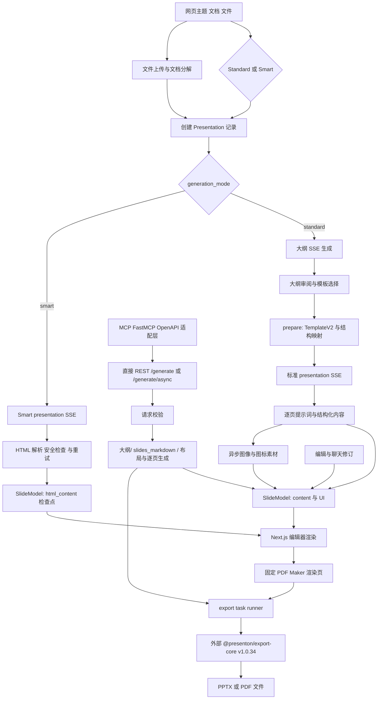

# Presenton 生成与导出调用链

任务：RES-P03-02 / TASK-RES-P03-02
研究版本：presenton/presenton，commit 35bf44290f821323e003da854f78ffcb0e918167（固定源码工作树 F:/YoloongPPT-Research/P03）

## 范围与结论

本文基于固定 commit 的实际源码追踪网页 Standard、网页 Smart、直接 REST、MCP、编辑修订和 PPTX 导出路径。每个图节点都在 source-index.json 中有源码路径、函数/类型定位或外部边界标记。这里只记录静态源码行为及单独列明的本地 HTTP 观测，不把源码存在等同于生成成功。

## 网页 Standard 路径

1. 上传页收集文本、配置和文件。文件路径先走 /api/v1/ppt/files/upload 与 /files/decompose；之后 POST /api/v1/ppt/presentation/create 建立 Presentation 记录。没有文件时跳过解析。UploadPage.tsx 中 getGenerationDestination 根据 generation_mode 分流：Standard 进入 /outline，Smart 直接进入 /presentation?type=smart。
2. Standard 的 useOutlineStreaming 连接 GET /api/v1/ppt/outlines/stream/{id}。后端 stream_outlines 调用 generate_ppt_outline；提示词由 get_system_prompt/get_user_prompt/get_messages 生成，并使用 PresentationOutlineModel / SlideOutlineModel 作为输出结构。结果写入 presentation.outlines 并以 SSE 返回，用户在 OutlinePage 审阅、修改大纲和选择模板。
3. 用户继续后，usePresentationGeneration 调用 POST /api/v1/ppt/presentation/prepare。prepare_presentation 解析 TemplateV2；有序布局直接产生结构，无序布局通过 generate_presentation_structure 按大纲和布局组织 layout index；之后规范化结构并保存。
4. 浏览器用 usePresentationStreaming 连接 GET /api/v1/ppt/presentation/stream/{id}。stream_presentation 对 Standard 路径逐页调用 get_slide_content_from_type_and_outline。该调用按布局生成 prompt，以结构化响应创建 slide content；Pydantic 结构定义见 PresentationStructureModel、layout 类型和模板 schema。
5. 后端构造 SlideModel 并套用模板组件数据；素材任务与下一页生成并行执行。标准路径调用 process_slide_and_fetch_assets 时设置 allow_image_fallback=true，失败会写 warning；这不是素材生成通过的证据，也未发现该主路径存在完整的 deck 级 QA gate。
6. SSE 将 slide 与完成状态送回编辑器。PresentationPage / PresentationRender 根据保存的 SlideModel 内容和 UI 结构渲染编辑页面。保存或单页更新走 /presentation/update 与 /presentation/slide_update。

## 网页 Smart 路径

1. 上传页仍创建 Presentation 记录，但把 generation_mode 设为 smart 并直接导航到编辑页。
2. 浏览器仍连接 /api/v1/ppt/presentation/stream/{id}；后端 stream_presentation 根据 generation_mode 转发到 stream_smart_presentation。
3. Smart 生成器读取 presentation 输入、文件内容和可选检索上下文，使用 generate_smart_presentation 内的 deck/continuation prompts 流式产出 HTML 页。服务端解析响应、规范化 HTML，并调用 _validate_smart_slide_layout_safety 检查受限布局/活动内容；失败路径包含流式错误和恢复处理。
4. 每张接受的页面以 layout_group/layout=smart-html、html_content 保存为 SlideModel 检查点，再通过 SSE 更新浏览器。这里的 HTML 是可编辑页面内容模型，不等同于已经验证的原生 PowerPoint 对象。
5. 独立 v2 REST 入口 /api/v2/ppt/presentation/generate/smart 与 /generate/smart/async 复用 Presentation 创建、Smart stream 和 export 服务。

## 直接 REST 与 MCP

- v1 POST /api/v1/ppt/presentation/generate 和 /generate/async 走 check_if_api_request_is_valid、generate_presentation_handler。请求支持 content、slides_markdown、files、instructions、tone、verbosity、language、template、web_search、slide count 与导出格式等字段。
- 输入可直接提供 slides_markdown；否则根据内容生成大纲。模板、结构、逐页内容和素材处理均在 handler 的同一主调用链内执行，然后持久化并导出。
- MCP 服务器从 OpenAPI 建立 FastMCP 适配器，并以 allowlist 限制对 MCP 客户端公开的端点，包括异步生成和文件上传；它复用 HTTP API，没有第二套幻灯片生成器。
- v1 请求检查显式拒绝空输入、非正页数、超限页数和无效模板。当前固定版本的上限从 MAX_NUMBER_OF_SLIDES 读取，实际数值应跟随该 commit 配置，不在本报告中写死。

## 输出、导出与修订

- 导出入口将 presentation id 与导出格式编码到 /pdf-maker URL。ExportTaskService 生成任务文件并启动 runner.mjs；根 package.json 将 presentationExportVersion 固定为 v1.0.34，scripts/run-presentation-export.mjs 调用 @presenton/export-core 的 runTask。
- PdfMakerPage 加载持久化页面，并固定成 1280×720 的打印画布；Smart 页面和 TemplateV2 页面在此渲染后交给 export-core。export-core 实现作为已固定版本的外部发布制品，不包含在当前 clone 中，属于明确黑盒。
- 修订包括 REST /edit 与 /derive；交互编辑包括 chat /message 与 /message/stream。ChatService 通过模型工具调用 addNewSlide、addNewSlideLayout、updateSlide、deleteSlide 及元素/组件操作，修改 SQL 中的 presentation/slide 数据。它们是编辑/派生路径，不应误当作生成时自动 QA。
- Provider 请求通过 llmai、llm_config、llm_provider 与 stream_generate_events 路由；实际供应商服务、密钥配置和模型输出在调用边界之外。本轮没有发送模型/API 生成请求。

## 检查边界

- 已核对 Standard、Smart、直接 REST、MCP adapter、编辑器和导出路径的关键函数及数据模型；引用清单见 source-index.json。
- 本地 HTTP：网页 GET / 为 200；GET /api/v1/auth/status 为 200 且 configured=false。对 /generate 的空输入与 n_slides=0 请求均收到 HTTP 428 “Login setup is required”，在 endpoint 输入校验之前被登录初始化门禁拦截。因此这些请求没有验证 payload 边界逻辑。
- 未配置 Presenton 登录、未连接 provider 凭据；没有执行大纲生成、Smart 生成、PPTX/PDF 导出、浏览器视觉审查或 deck QA。正常生成路径尚无运行证据，VERIFY-RES-P03-02 保持进行中。
