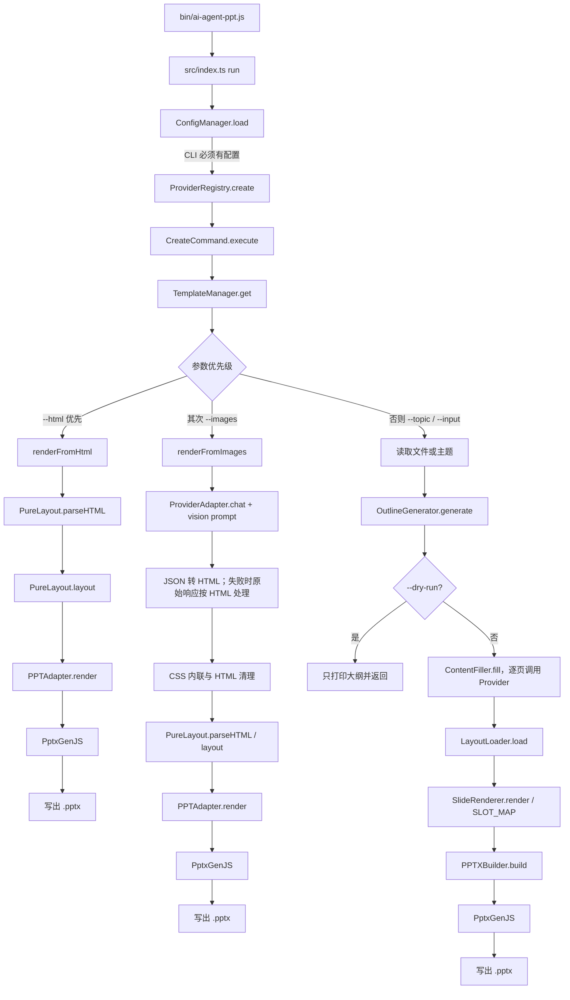

# ai-agent-ppt 从输入到 PPTX 的源码调用链

## 研究范围

- Requirement ID：`RES-P04-02`
- Task ID：`TASK-RES-P04-02`
- 来源：固定上游 `peterfei/ai-agent-ppt`，`main` commit `c3605ebc487fc6c7d4f4139761e46d7021cd656c`，MIT。
- 本文描述该固定快照的源码行为，不代表 YoloongPPT 已选择 Node.js、PptxGenJS 或任何产品运行时。
- 代码证据对应研究 clone `F:\YoloongPPT-Research\P04`；完整文件、函数和行号见 [source-index.json](source-index.json)。

## 路由总图

图中的 DeepSeek/GLM 服务、`purelayout` 算法、PptxGenJS OOXML 序列化器和图片 URL 请求均是外部实现或服务，见下方“外部黑盒”。

## CLI 与共同前置步骤

1. `bin/ai-agent-ppt.js` 导入 `dist/index.js` 并调用 `run()`。`src/index.ts` 暴露 `init`、`create`、`template` 三条 CLI 命令。
2. `create` 在调用 `CreateCommand` 前读取 `~/.ai-agent-ppt/config.json`；配置缺失或无效时直接退出。随后 `ProviderRegistry` 只构造 `deepseek` 和 `glm`。配置 schema 虽接受 `claude`、`openai`、`kimi`，注册表没有对应实现，选择它们会报“not implemented”。
3. `CreateCommand.execute()` 再加载配置，模板优先级为命令行 `--template`、配置默认值、`tech`。模板文件由 `TemplateManager.get()` 读取并通过 Zod schema 校验；缺失/无效模板会中止。
4. 路由按源码顺序判断：有 `--html` 就进入 HTML 路线；否则有 `--images` 进入图片路线；其余情况进入 `--topic`/`--input` 路线。若同时提供 HTML 与图片，HTML 获胜。

CLI 外层要求存在有效配置和已实现的 provider，所以 HTML 虽然不发起模型请求，仍需通过 CLI 的配置/provider 初始化门槛。直接构造 `CreateCommand` 的测试入口可以注入假 provider，跳过网络服务。

## 主题 / 文件输入路线

1. `--input` 是文件时按 UTF-8 读取；是目录时 `scanDirectory()` 只读取根目录下 `README.md` 和 `package.json`，忽略其余文件及扫描异常。未给 `--input` 时使用 `--topic`；两者都缺失会抛出参数错误。
2. `OutlineGenerator.generate()` 把输入、模板名和语言放入 user prompt；system prompt 要求 5–15 页、8 种 layout 名称、每份大纲至少有一个 image/image-text 页和 Unsplash URL。响应只检查 JSON 可解析、存在 title 和 slides 数组，没有逐字段 schema 校验。
3. 大纲生成经过 `withRetry()`，默认最多 3 次，间隔 2 秒和 4 秒。`--dry-run` 在这一步后只打印大纲并返回。
4. `ContentFiller.fill()` 按 slide 顺序逐页请求 Provider，把 `expandedText`、`speakerNotes` 合并到 slide；任何请求或 JSON 解析异常都会被捕获，原 outline slide 被保留，异常不会继续传播。
5. `LayoutLoader.load()` 读取 `{name}.layout.json` 并校验 schema。缺失或解析失败返回 `null`；`CreateCommand` 跳过该页并累计数量，然后仍调用 `PPTXBuilder.build()`。因此全页 layout 失效也可能留下一个没有预期页面的输出文件。
6. `SlideRenderer` 用 JSON layout 树和 `SLOT_MAP` 绑定内容。映射键只有 `title`、`subtitle`、`code`、`notes`、`image`、`bulletPoints`。`chartData`、`timelineData`、`comparisonItems` 虽在 prompt/types 中出现，但这条渲染路径没有对应 slot 映射。
7. `PPTXBuilder` 将 StyleNode 扁平为顺序文本块和图片块，按游标依次写入文字/图片及装饰形状。它没有把布局树几何完整传给 PowerPoint，也没有从本路径调用 QA、修订或现有 PPT 读改写服务。

本次禁网假 Provider 验证选用 `bullet` layout：成功填充与内容填充异常回退产出的 PPTX SHA-256 相同。源码可解释该结果：`bullet.layout.json` 只有 title/bulletPoints 槽位，`expandedText` 与 `speakerNotes` 没有被该 layout 消费；这不表示其他包含 subtitle/notes 槽的 layout 一定相同。

## 直接 HTML 路线

`renderFromHtml()` 在 1280×720 视口解析简化 HTML，调用 `PureLayout.layout()` 得到布局框，再通过 `PPTAdapter.render()` 将文字、图片和背景映射到 PptxGenJS slide，最后写入 `.pptx`。P04-01 的官方 README HTML 样例与嵌套 HTML 样例已有禁网运行及 PPTX ZIP/XML 检查证据，见 `validation/verify-res-p04-01.json`。

## 图片 / 截图还原路线

1. `renderFromImages()` 接受单张图片或目录；目录筛选 PNG/JPG/JPEG/WEBP 并排序。空目录显式报错。
2. 每张图转 base64 后发送 vision prompt，要求返回背景色、标题、副标题和 sections JSON。模型服务是否能识别图片由所选 provider/模型决定，源码未建立独立视觉 provider 路由。
3. JSON 解析成功时 `visionJSONtoHTML()` 生成 HTML；失败时把完整原始响应作为 HTML fallback，随后内联一小部分 CSS、剥除部分标签、移除 class 并补包多根节点。
4. `PureLayout` 计算 1280×720 布局，`PPTAdapter` 写入每张 slide。单张图异常只标失败并继续；整个循环结束后仍保存 PPTX。结束提示的页数是输入文件数，不一定等于成功 slide 数。
5. MIME 推导只对 PNG 使用 `image/png`，其他扩展名均标成 `image/jpeg`；因此目录接受 WEBP，但发给 vision provider 时不会声明为 WebP。该差异是固定源码的观察结果，尚未实测 WebP 路线。

## 外部黑盒与未发现的节点

- **模型 API**：DeepSeek 通过 OpenAI SDK 请求 `https://api.deepseek.com`；GLM 通过 `fetch` 请求智谱 API。服务端模型行为、响应稳定性和错误内容无法从仓库源码还原。
- **`purelayout@0.3.1`**：源码调用 npm 包完成 CSS 布局测量；仓库 wrapper 自行解析简化 HTML/CSS，并对 flex 子节点位置做补正。包内部布局算法属于外部黑盒。
- **`pptxgenjs@4.0.1`**：项目调用它添加文本/图片/形状并序列化 PPTX。OOXML 包装、关系和媒体部件细节由第三方库生成。
- **图片 URL 网络请求**：`PPTXBuilder` 和 `PPTAdapter` 使用 `fetch`，有 10 秒超时；失败时的行为由具体调用点决定，图片可能改用 path 或不设置背景。
- **页面输出**：固定源码中未发现浏览器页面、HTML 页面成品、HTTP/API/MCP 服务或编辑器交付流水线。已定位的输出链只写 `.pptx`；不能把 PureLayout 的内部布局树称为页面交付。
- **QA / revision / 现有 PPT**：`src/index.ts` 只有 init/create/template 命令，当前 create 链没有结构/视觉/事实 QA、局部修订或已有 PPT 读改写节点。PptxGenJS 生成的文件是否在 PowerPoint 中无修复打开、视觉是否合格，尚无本任务证据。

## 本次验证与限制

`validation/verify-res-p04-02.mjs` 在 Node 24.14.0 Docker 容器中执行；容器 `--network none`，使用注入式假 Provider，不使用真实凭据或模型/API。正常主题路线生成 PPTX，内容填充错误被捕获后仍生成 PPTX，缺输入在零 Provider 调用时按预期失败。两个 PPTX 的必需 ZIP 部件和 slide 文本已检查，结果在 `validation/verify-res-p04-02.json`。

没有运行上游 Vitest 测试套件，没有调用真实模型、Vision 服务或图片 URL，没有用 PowerPoint/LibreOffice 渲染。Node 24.14.0 是本次研究容器的环境观测，不构成 YoloongPPT 技术选型。
