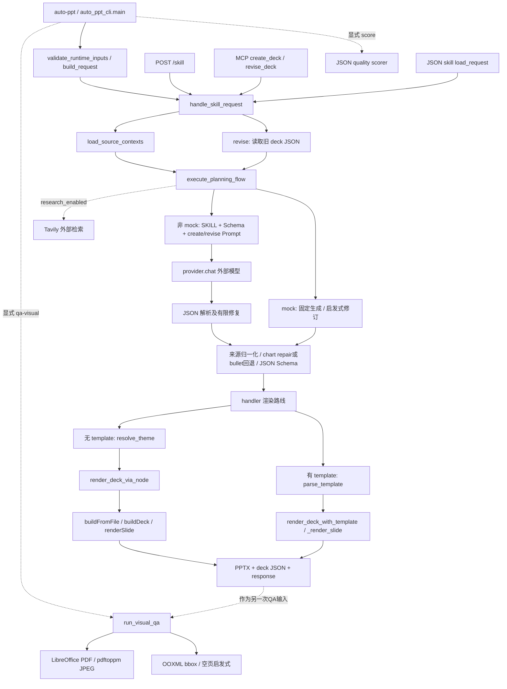

# P05 输入、生成、渲染、QA 与修订调用链

关联 `RES-P05-02`、`TASK-RES-P05-02`、`VERIFY-RES-P05-02`；固定 commit `5ae0670747885c464aa8063329a902d80a251877`。文件/函数/行号/源码哈希和运行覆盖状态见 [source_index.json](source_index.json)。

## 节点与实际覆盖

- CLI、HTTP、MCP、JSON skill 都可进入 handler，但入口校验并不完全相同；`load_request` 的 action/prompt 校验属于 JSON 文件入口，不能宣称每个入口都执行它。HTTP/MCP 本轮只定位源码，没有发起服务或工具调用。
- 主链以 deck JSON 为内部契约，Schema `0.3.0`；规划器对模型结果有 JSON/schema 修复循环，chart 数据修复或降为 bullet 的说明写入 assumptions。真实模型和 Tavily 未在本次禁网 mock 试验运行。
- 来源 loader 保留 metadata/context；超过 5000 字符的 excerpt 会裁剪，handler 将 truncation 说明写入 assumptions。官方 source brief 实际加载了 1 条来源。本轮未用长来源探针验证所有裁剪分支。
- 默认 renderer 是 PptxGenJS：固定宽屏画布、命名主题、固定 layout dispatch，输出文本/形状可读；正常图表采用图片，PPTX 没有原生 chart parts。JS 单独入口可设置 `--native-charts`，Python bridge 的本轮默认路径未传该选项。
- template 路线解析 Master/Layout/placeholder，再用 python-pptx 输出；源码明确先删除 template 的所有旧 slides，再新建。它不能作为任意已有 PPTX 的保留式局部编辑能力。该分支本轮未运行。
- 生成 handler 不自动执行 `qa-visual`。独立 QA 路线调用 LibreOffice/PDF 光栅化及包围盒启发式；严格 CLI 在存在任何告警时返回 1。不是事实校验、像素级审查、自动修复或端到端质量通过的证明。
- `revise` 读取已生成的 deck JSON，mock 路线调用 `apply_heuristic_revision`，再通过相同 renderer 完整输出新文件。实测由 8 页压缩为 6 页；没有读取旧 PPTX 并保留原对象/动画的证据。

## 正常、边界与失败证据

[baseline-run.json](validation/baseline-run.json) 保存实际命令、返回码、产物及哈希；不是函数级运行插桩 trace。

| 探针 | 实际结果 | 结论范围 |
|---|---|---|
| 官方 8 页 mock + sample source | CLI 0；8 页 JSON/PPTX；ZIP 与 python-pptx 读取通过 | 官方离线最小生成已复现，不是模型生成 |
| 请求 1 页 | CLI 0；实际 5 页 | `clamp_slide_count` 限制改变请求；本轮不能证明硬约束服从 |
| 缺失 source | CLI 1；明确文件不存在及参数提示 | 入口阶段拒绝，没有该失败用例的 PPTX |
| 旧 deck JSON 压缩到 6 页 | CLI 0；6 页修订产物 | JSON 重规划/重渲染，非 PPTX 原位编辑 |
| `qa-visual --strict` | 导出 8 张图；27 告警；CLI 1 | 8 个边缘、19 个候选重叠；严格 QA 未通过 |

正常 8 页 contact sheets 已逐页查看，并打开第 7/8 页全尺寸图：图表实际是图片；末页正文/副标题在深色背景上对比度过低。QA 报告 `highRiskSlides=[]`，没有覆盖这个人工发现的对比度问题。此结果直接限制后续选型对 QA 的信任范围。

候选许可声明仍冲突（根 AGPL、部分元数据 Apache）；图谱不是代码复用/分发决定。后续 P05-03/04/05 已完成映射及补测，见 [verify-res-p05-03-05.json](validation/verify-res-p05-03-05.json)。模板旧页删除实际失败、零页面模板可写、KPI fallback/图表补零等新增事实以该报告为准；首次调用链记录中的 template source-only 范围保留为历史。JS 分派实际为 17 个 key，详见 ProjectTemplateMap。
